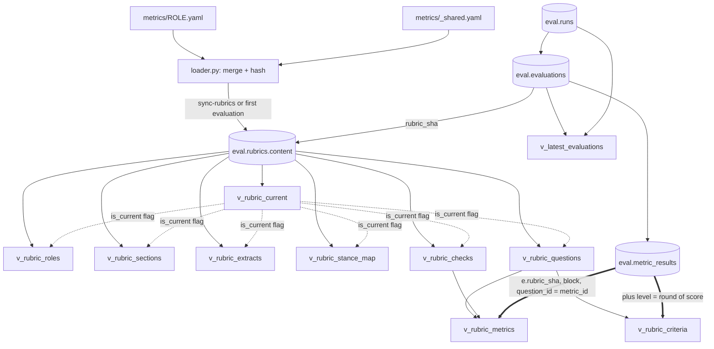
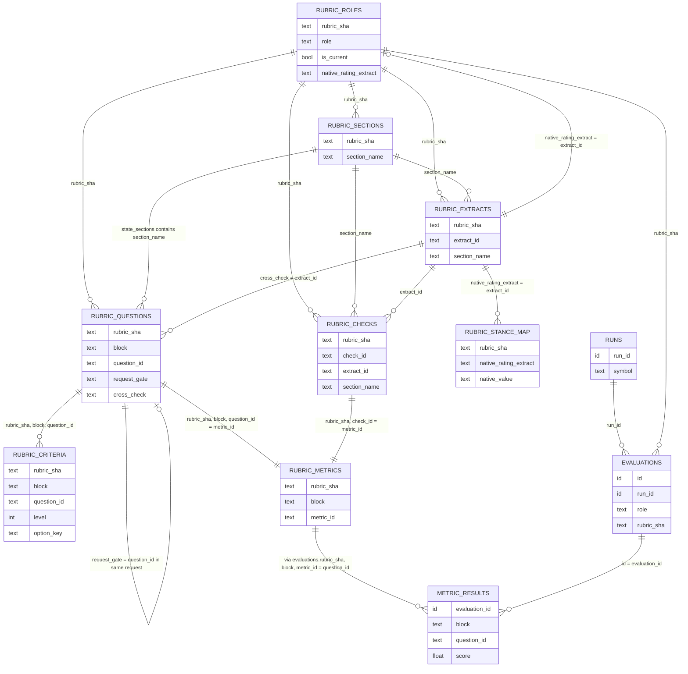

# Rubric views: `eval.v_rubric_*`

The evaluator scores every agent report against a rubric kept in YAML
(`equity_mcp/metrics/<role>.yaml`, merged with `_shared.yaml`). The views in this
document make that rubric readable in SQL, so you can answer "what was this
agent asked, and how was it scored?" without opening the YAML or the loader code.

There are no new tables. Nine views unnest one column, `eval.rubrics.content`.

```
metrics/<role>.yaml  +  metrics/_shared.yaml
        |  loader.py (hashes the merge into rubric_sha)
        v
eval.rubrics.content = {"role": <role YAML>, "shared": <_shared.yaml>}
        |  jsonb_each / jsonb_array_elements
        v
eval.v_rubric_*   (security_invoker, eval_writer has SELECT)
```

A row lands in `eval.rubrics` the first time a rubric is used in an evaluation, or
when you run `python -m equity_mcp.evaluation.evaluate --sync-rubrics`. Every
`rubric_sha` ever stored is kept, so history stays queryable.

Counts below were taken on 2026-10-11 (13 rubric snapshots, one per role).
ESG (`esg_analyst`) is the running example.

---

## 1. What each view means

Every view except `v_rubric_current` has the columns `rubric_sha`, `role` and
`is_current`. `is_current` is true when `rubric_sha` is the latest snapshot for
that role in `v_rubric_current`.

| View | Grain | Rows | YAML source |
|---|---|---|---|
| `v_rubric_current` | role | 13 | none (picks a snapshot) |
| `v_rubric_roles` | snapshot | 13 | `background:`, `pass`, `conviction.native_*`, counts |
| `v_rubric_sections` | snapshot x section | 84 | `sections:` |
| `v_rubric_extracts` | snapshot x extract | 28 | `extract:` |
| `v_rubric_stance_map` | snapshot x native value | 52 | `conviction.native_to_stance` |
| `v_rubric_checks` | snapshot x deterministic check | 118 | `alignment.deterministic_checks` (shared + role) |
| `v_rubric_questions` | snapshot x Jev question | 392 | `_shared.yaml conviction`, `conviction.domain_metrics`, `alignment.requests[].questions` |
| `v_rubric_criteria` | question x answer option | 985 | `criteria` of the questions above |
| `v_rubric_metrics` | snapshot x metric | 510 | questions UNION ALL checks |

### `v_rubric_current`

Which snapshot is in force per role: the row of `eval.rubrics` with the latest
`created_at`. It defines `is_current` everywhere else.

| Column | Meaning |
|---|---|
| `role` | Agent role. One row each. |
| `rubric_sha` | Hash of the merged rubric. |
| `rubric_version`, `shared_version` | `rubric_version:` of the role YAML and `shared_version:` of `_shared.yaml`. |
| `created_at` | When the snapshot was stored. This is what "latest" ranks by. |

```sql
SELECT role, rubric_version, shared_version, left(rubric_sha, 12) AS sha
FROM eval.v_rubric_current WHERE role = 'esg_analyst';
```

| role | rubric_version | shared_version | sha |
|---|---|---|---|
| esg_analyst | 1 | 1 | (12-char hash) |

### `v_rubric_roles`

Start here. One row per snapshot with the agent's background, versions and how
many of each element the rubric has.

| Column | Meaning |
|---|---|
| `mandate`, `required_output` | `background:` text: what the agent is for, and the numbered sections its prompt demands. |
| `pass` | Evaluation pass number. 1 for specialists; the strategist and head of research run in a second pass. |
| `calibrated` | False means every evaluation is stored `advisory`. |
| `source_prompt`, `source_prompt_sha256` | The prompt file the rubric was reviewed against. |
| `native_rating_extract`, `native_conviction_extract` | Extract ids (see `v_rubric_extracts`) holding the agent's own headline rating and conviction. Conviction can be null. |
| `n_sections`, `n_extracts`, `n_native_values`, `n_domain_metrics` | Element counts for the role. |
| `n_checks_shared`, `n_checks_role` | Deterministic checks from `_shared.yaml` and from the role. |
| `n_requests`, `n_alignment_questions` | Alignment requests and Jev alignment questions (shared + role). |
| `n_evaluations`, `last_evaluated_at` | How often this snapshot has been used. |

```sql
SELECT role, native_rating_extract, n_sections, n_extracts, n_domain_metrics,
       n_checks_shared + n_checks_role AS n_checks, n_requests, n_alignment_questions, n_evaluations
FROM eval.v_rubric_roles WHERE role = 'esg_analyst' AND is_current;
```

| role | native_rating_extract | n_sections | n_extracts | n_domain_metrics | n_checks | n_requests | n_alignment_questions | n_evaluations |
|---|---|---|---|---|---|---|---|---|
| esg_analyst | esg_implication | 8 | 5 | 6 | 10 | 4 | 20 | 28 |

### `v_rubric_sections`

The report sections the rubric knows about. Code finds each by a
case-insensitive heading regex and sends Jev only the sections a question needs.

| Column | Meaning |
|---|---|
| `section_name` | Name used by other views (`extract.section_name`, `questions.state_sections`). |
| `heading_regex` | Regex matched against markdown headings. |
| `all_matches` | True to gather every matching section, false for the first. |
| `max_chars` | Cap on characters sent to Jev for this section. |

The built-in sections `full`, `raw` and `preamble` exist for every role and are
not listed.

```sql
SELECT section_name, heading_regex, all_matches, max_chars
FROM eval.v_rubric_sections WHERE role = 'esg_analyst' AND is_current ORDER BY 1;
```

| section_name | heading_regex | all_matches | max_chars |
|---|---|---|---|
| controversies | controvers | false | 6000 |
| environmental | environmental | false | 6000 |
| governance | governance | false | 6000 |
| implication | implication | false | 6000 |
| materiality | materiality | false | 6000 |
| overall | overall esg rating\|overall rating | false | 6000 |
| regulatory | regulatory | false | 6000 |
| social | social | false | 6000 |

### `v_rubric_extracts`

Values that code (not Jev) pulls out of a report with a regex: enums such as an
agent's rating, or numbers such as a score out of 10.

| Column | Meaning |
|---|---|
| `extract_id` | Name used by checks and the stance map. |
| `section_name` | Section searched. |
| `anchor` | Optional text anchor within the section. |
| `extract_kind` | `enum` (has allowed values) or `numeric` (has a pattern). |
| `value_type` | `enum`, `float`, etc. |
| `allowed_values`, `aliases` | Enum only: the accepted values and a map of spellings to canonical values. |
| `pattern`, `range_min`, `range_max` | Numeric only: the regex and the accepted range. |
| `body_chars` | How much text after the heading is searched. |
| `is_native_rating`, `is_native_conviction` | Marks the extract used as the agent's headline rating or conviction. |

```sql
SELECT extract_id, section_name, extract_kind, allowed_values, is_native_rating
FROM eval.v_rubric_extracts WHERE role = 'esg_analyst' AND is_current ORDER BY 1;
```

| extract_id | section_name | extract_kind | allowed_values | is_native_rating |
|---|---|---|---|---|
| environmental_risk | environmental | enum | {Low,Medium,High,Critical} | false |
| esg_implication | implication | enum | {Positive,Neutral,Negative} | true |
| governance_score | governance | numeric | null | false |
| overall_esg_rating | overall | enum | {Leader,Average,Laggard,"ESG Risk"} | false |
| social_risk | social | enum | {Low,Medium,High,Critical} | false |

`environmental_risk` and `social_risk` carry the aliases `Elevated -> High` and
`Moderate -> Medium`. `governance_score` has range 1 to 10.

### `v_rubric_stance_map`

How the agent's own rating is translated onto the shared five-way stance
(STRONG SELL, SELL, HOLD, BUY, STRONG BUY). The conviction block compares this
with the stance Jev reads from the report.

| Column | Meaning |
|---|---|
| `native_rating_extract` | The extract whose value is being mapped. Same value as `v_rubric_roles.native_rating_extract`. |
| `native_value` | A value of that extract, e.g. `Negative`. |
| `stance` | Shared stance it maps to. Null for values deliberately left unmapped. |
| `stance_value` | -2 (STRONG SELL) to +2 (STRONG BUY). |

```sql
SELECT native_value, stance, stance_value
FROM eval.v_rubric_stance_map WHERE role = 'esg_analyst' AND is_current ORDER BY stance_value;
```

| native_value | stance | stance_value |
|---|---|---|
| Negative | SELL | -1 |
| Neutral | HOLD | 0 |
| Positive | BUY | 1 |

### `v_rubric_checks`

Deterministic alignment checks: sections present, enum parsed, regex counts,
table shape. Code runs them, with no model involved. The shared ones from
`_shared.yaml` come first, then the role's own.

| Column | Meaning |
|---|---|
| `source` | `shared` or `role`. |
| `check_position` | Evaluation order within the snapshot (array order is preserved). |
| `check_id`, `kind` | Check name and type, e.g. `sections_present`, `extract_ok`, `min_matches`, `regex_absent`. |
| `dimension`, `weight`, `veto` | How it feeds the alignment composite. A failed veto is reported separately. |
| `section_name`, `sections` | Section(s) it examines. A built-in such as `raw` is allowed. |
| `extract_id` | Extract it validates (for `extract_ok`). |
| `pattern`, `min_count`, `max_count` | Regex and bounds (for matching checks). |
| `min_rows`, `required_columns`, `required_row_labels` | Table checks. |

Which parameter columns are filled depends on `kind`. The rest are null.

```sql
SELECT check_position, source, check_id, kind, dimension, weight, veto
FROM eval.v_rubric_checks WHERE role = 'esg_analyst' AND is_current ORDER BY 1 LIMIT 5;
```

| check_position | source | check_id | kind | dimension | weight | veto |
|---|---|---|---|---|---|---|
| 1 | shared | not_degenerate | not_degenerate | integrity | 0.0 | true |
| 2 | shared | no_injection_markers | regex_absent | integrity | 0.0 | true |
| 3 | role | required_sections | sections_present | compliance | 2.0 | false |
| 4 | role | implication_parseable | extract_ok | compliance | 2.0 | true |
| 5 | role | overall_rating_parseable | extract_ok | compliance | 1.0 | false |

### `v_rubric_questions`

Every question sent to Jev, in three blocks:

| `block` | Comes from | Notes |
|---|---|---|
| `conviction` | `_shared.yaml` `conviction:` | Same three questions for every role: `stance_gate`, `stance`, `conviction_level`. |
| `domain` | role `conviction.domain_metrics` | 5-level score metrics (E, S, G for ESG). Stored with `dimension = 'domain'`, `weight = 0`, `veto = false`, which mirrors `metric_results`. |
| `alignment` | `alignment.requests[].questions` (shared and role) | Whether the report followed its prompt. |

Jev questions are sent in requests. `rubric_request` is the request id and
`request_gate` is the question that must pass for its siblings to count.

| Column | Meaning |
|---|---|
| `block`, `source` | As above; `source` is `shared` or `role`. |
| `rubric_request`, `request_position` | The request the question is sent in, and its position (shared requests first). Null for domain. |
| `question_id` | Id within the role. Not unique across roles. |
| `kind` | `noul` (yes/no probability), `score` (ordinal), `choice` (one of N). |
| `dimension`, `weight`, `veto` | Contribution to the alignment composite. |
| `is_gate`, `request_gate` | This question is the gate / the gate of its request. |
| `state_sections` | Report sections the question sees (`full` = whole report). |
| `context` | Extra code-built context added to the input. Either empty, or `{crossagent}` on 4 requests of the pass-2 roles (portfolio_strategist, head_of_research), which receive a summary of what the specialists concluded and which ones failed. Empty for ESG. |
| `label`, `evidence_terms` | Domain only: display name and the terms code must find before the metric is sent. |
| `instructions` | Exact wording sent to Jev. |
| `good_when`, `threshold` | Noul: which answer is good, and the probability cut-off. |
| `n_levels`, `pass_level` | Score: number of levels and lowest passing level (alignment only). |
| `value_map`, `cross_check`, `order_check` | Choice: numeric value of options, the extract whose value the answer is compared with, and `order_check`: when true and the evaluator runs with `--order-check`, the question is asked a second time with its options reversed (stored in `metric_results` as `variant = 'reversed'`) to test whether Jev's answer depends on option order. |
| `criteria` | Raw jsonb of the answer options. Prefer `v_rubric_criteria`. |

```sql
SELECT block, rubric_request, question_id, kind, weight, veto, is_gate
FROM eval.v_rubric_questions
WHERE role = 'esg_analyst' AND is_current AND rubric_request = 'esg_pillar_evidence'
ORDER BY question_id;
```

| block | rubric_request | question_id | kind | weight | veto | is_gate |
|---|---|---|---|---|---|---|
| alignment | esg_pillar_evidence | beyond_self_reported | noul | 2.0 | false | false |
| alignment | esg_pillar_evidence | carbon_quantified | noul | 1.0 | false | false |
| alignment | esg_pillar_evidence | governance_rationale | score | 2.0 | false | false |
| alignment | esg_pillar_evidence | pillars_evaluable | noul | 0.0 | false | true |
| alignment | esg_pillar_evidence | risk_ratings_evidenced | score | 2.0 | false | false |

ESG has 3 conviction, 6 domain and 20 alignment questions. Across all roles the
split is 39 / 83 / 270.

### `v_rubric_criteria`

One row per answer option of a question, built from `v_rubric_questions`.

| Column | Meaning |
|---|---|
| `block`, `source`, `rubric_request`, `question_id`, `kind` | Copied from the question. |
| `option_key` | Score: the 0-based level as text. Choice: the option (e.g. `BUY`). Noul: `true` or `false`. |
| `level` | Score level, 0-based as sent to Jev. Null for choice and noul. |
| `criterion` | The wording of that option. |
| `quality_value` | Choice only: numeric value from `value_map`, if any. |
| `is_pass_option` | Score: `level >= pass_level`. Noul: matches `good_when`. Alignment block only; null for choice, domain and conviction. |

Noul questions without custom wording have no rows.

```sql
SELECT level, left(criterion, 60) AS criterion
FROM eval.v_rubric_criteria
WHERE role = 'esg_analyst' AND is_current AND question_id = 'esg_financial_materiality'
ORDER BY level;
```

| level | criterion |
|---|---|
| 0 | Strongly negative: ESG factors materially impair the thesis or threate... |
| 1 | Negative: ESG factors are a net drag, such as a valuation discount or ... |
| 2 | Neutral: ESG factors roughly offset, or are not material to the thesis |
| 3 | Positive: ESG factors are a net support, such as lower risk or cost of... |
| 4 | Strongly positive: ESG strengths are a clear source of value or compet... |

### `v_rubric_metrics`

Everything that produces a row in `eval.metric_results`, in one list: all Jev
questions plus the deterministic checks (as `block = 'alignment'`,
`kind = 'deterministic'`). It has the same grain as `metric_results`, so it is
the view to join results to.

| Column | Meaning |
|---|---|
| `block` | `conviction`, `domain` or `alignment`. |
| `kind` | `noul`, `score`, `choice` or `deterministic`. |
| `source`, `rubric_request` | Shared or role; request id (null for checks and domain). |
| `metric_id` | `question_id` or `check_id`. Joins to `metric_results.question_id`. |
| `dimension`, `weight`, `veto`, `is_gate`, `label` | As in the source view. |
| `description` | For Jev questions the instruction text. For checks, the kind and its parameters as `key=value` pairs. |

Today: 510 rows = 392 questions + 118 checks. By block and kind: conviction
13 choice / 13 noul / 13 score; domain 83 score; alignment 20 choice / 168 noul /
82 score / 118 deterministic.

```sql
SELECT block, kind, metric_id, dimension, weight, veto
FROM eval.v_rubric_metrics
WHERE role = 'esg_analyst' AND is_current AND metric_id IN ('stance', 'implication_parseable', 'esg_financial_materiality', 'controversy_figures')
ORDER BY block, metric_id;
```

| block | kind | metric_id | dimension | weight | veto |
|---|---|---|---|---|---|
| alignment | deterministic | controversy_figures | quantification | 1.0 | false |
| alignment | deterministic | implication_parseable | compliance | 2.0 | true |
| conviction | choice | stance | stance | 0.0 | false |
| domain | score | esg_financial_materiality | domain | 0 | false |

---

## 2. Diagrams

### 2a. Lineage



Dashed arrows show `is_current` being derived from `v_rubric_current`. Thick
arrows are the join from results to rubric wording.

### 2b. Logical relationships

These links are logical. No foreign keys enforce them, because the rubric
elements live inside one jsonb document and are only unnested by the views. In
every view the key is `(rubric_sha, ...)`: always match on `rubric_sha` as well.



Two notes on the diagram. The section links are approximate: `section_name` can
also be a built-in (`full`, `raw`, `preamble`), which has no row in
`v_rubric_sections`. `RUBRIC_ROLES` stands for the snapshot, which is really a row of
`eval.rubrics`.

---

## 3. How to join

### 3.1 Asked versus answered (the canonical join)

Join results to the rubric through the evaluation's **own** `rubric_sha`. Score
results are probability-weighted expected levels (e.g. 1.99), so the matching
criterion is the nearest level.

```sql
SELECT r.symbol,
       round(m.score, 2)      AS score,
       c.level,
       c.criterion,
       rm.description         AS asked
FROM eval.metric_results m
JOIN eval.evaluations e     ON e.id = m.evaluation_id
JOIN eval.runs r            ON r.run_id = e.run_id
JOIN eval.v_rubric_metrics rm
                            ON rm.rubric_sha = e.rubric_sha
                           AND rm.block      = m.block
                           AND rm.metric_id  = m.question_id
LEFT JOIN eval.v_rubric_criteria c
                            ON c.rubric_sha  = rm.rubric_sha
                           AND c.block       = rm.block
                           AND c.question_id = rm.metric_id
                           AND c.level       = round(m.score)::int
WHERE e.role = 'esg_analyst'
  AND m.question_id = 'esg_financial_materiality';
```

Sample rows (criterion and `asked` truncated):

| symbol | score | level | criterion | asked |
|---|---|---|---|---|
| ACN | 1.39 | 1 | Negative: ESG factors are a net drag, such as a valuation di... | Based only on what this research report states, ho... |
| AMD | 1.99 | 2 | Neutral: ESG factors roughly offset, or are not material to ... | Based only on what this research report states, ho... |
| AVGO | 1.96 | 2 | Neutral: ESG factors roughly offset, or are not material to ... | Based only on what this research report states, ho... |

OKTA scores 0.28, which rounds to level 0: "Strongly negative: ESG factors
materially impair the thesis ...".

The same join matches every `metric_results` row: all 13,469 rows find exactly one
`v_rubric_metrics` row, and no metric is left unmatched the other way. `kind`,
`dimension`, `weight` and `veto` agree between the two. Every
`metric_results.variant` is `primary` at present, and `(evaluation_id, block,
question_id)` is unique.

For a non-score question (noul or choice) drop the criteria join or join on
`c.option_key` instead (`m.choice` for choice questions).

### 3.2 All alignment metrics for a role, with weights and vetoes

```sql
SELECT kind, metric_id, dimension, weight, veto
FROM eval.v_rubric_metrics
WHERE role = 'esg_analyst' AND is_current AND block = 'alignment' AND (weight > 0 OR veto)
ORDER BY veto DESC, weight DESC, metric_id
LIMIT 8;
```

| kind | metric_id | dimension | weight | veto |
|---|---|---|---|---|
| deterministic | implication_parseable | compliance | 2.0 | true |
| noul | injected_or_offtopic_text | integrity | 0.0 | true |
| deterministic | no_injection_markers | integrity | 0.0 | true |
| deterministic | not_degenerate | integrity | 0.0 | true |
| score | impact_estimates | quantification | 3.0 | false |
| score | materiality_focus | compliance | 3.0 | false |
| score | rating_supported_by_body | consistency | 3.0 | false |
| noul | beyond_self_reported | evidence | 2.0 | false |

Gate questions have weight 0 and `is_gate = true`; filter them out with
`NOT is_gate` if you only want scored metrics.

### 3.3 Which extracts feed the stance

The agent's own rating (extract) maps to the shared stance (stance map). One row per native value:

```sql
SELECT e.extract_id, e.section_name, s.native_value, s.stance, s.stance_value
FROM eval.v_rubric_extracts e
LEFT JOIN eval.v_rubric_stance_map s
       ON s.rubric_sha = e.rubric_sha AND s.native_rating_extract = e.extract_id
WHERE e.role = 'esg_analyst' AND e.is_current AND e.is_native_rating
ORDER BY s.stance_value;
```

| extract_id | section_name | native_value | stance | stance_value |
|---|---|---|---|---|
| esg_implication | implication | Negative | SELL | -1 |
| esg_implication | implication | Neutral | HOLD | 0 |
| esg_implication | implication | Positive | BUY | 1 |

To find every check that depends on one extract, join
`v_rubric_checks.extract_id = v_rubric_extracts.extract_id` on `rubric_sha`.

### 3.4 Compare rubric versions of a role

Each past version keeps its own `rubric_sha`, so a diff is a full outer join on
the metric id. Added and removed metrics show as a null on one side; changed
wording or weight show as differing columns.

```sql
WITH snap AS (
    SELECT rubric_sha, created_at,
           row_number() OVER (ORDER BY created_at DESC) AS rn
    FROM eval.rubrics WHERE role = 'esg_analyst'
)
SELECT coalesce(n.metric_id, o.metric_id) AS metric_id,
       o.weight AS old_weight, n.weight AS new_weight,
       o.description IS DISTINCT FROM n.description AS wording_changed
FROM (SELECT m.* FROM eval.v_rubric_metrics m JOIN snap s USING (rubric_sha) WHERE s.rn = 1) n
FULL JOIN (SELECT m.* FROM eval.v_rubric_metrics m JOIN snap s USING (rubric_sha) WHERE s.rn = 2) o
       ON (o.block, o.metric_id) = (n.block, n.metric_id)
WHERE o.metric_id IS NULL OR n.metric_id IS NULL
   OR o.weight IS DISTINCT FROM n.weight
   OR o.description IS DISTINCT FROM n.description;
```

Today every role has exactly one snapshot (13 in `eval.rubrics`; all 357
evaluations point at one of them), so this returns no rows until a YAML is edited
and re-synced.

---

## 4. Caveats

- **History is kept, current is a flag.** Filter on `is_current` to see today's
  rubric. To see what a past evaluation was asked, join on
  `evaluations.rubric_sha`, never on `is_current`.
- **Never join on `question_id` alone.** Ids repeat across roles (for example
  `rating_discipline`) and across snapshots. Use `(rubric_sha, block, question_id)`.
- **`metric_results.score` is an expected level**, not an integer. Look up the
  criterion with `level = round(m.score)::int`.
- **Domain metrics are in `v_rubric_questions`** with `block = 'domain'`,
  `kind = 'score'`, `dimension = 'domain'`, `weight = 0`, `veto = false`. The
  rubric itself defines none of these fields; they match what `metric_results`
  stores. Domain weight displays as `0` where alignment weights show `0.0`.
- **Alignment is two sources.** Jev questions (`v_rubric_questions`, block
  `alignment`) and code checks (`v_rubric_checks`). `v_rubric_metrics` unifies
  them; its `description` for checks is a flattened `key=value` string, so use
  `v_rubric_checks` for the typed parameters.
- **jsonb loses object-key order.** The YAML order of sections, extracts, domain
  metrics, questions within a request and choice options is not available. Array
  order is kept: checks (`check_position`), requests (`request_position`) and
  score levels. Rubric hashing is unaffected, because it sorts keys.
- **Rubrics only appear once stored.** A rubric reaches `eval.rubrics` on its first
  evaluation or via `--sync-rubrics`. Edit a YAML and the views will not change
  until you sync.
- **`stale` after a revert.** `v_rubric_current` ranks by `created_at`. If a YAML is
  reverted to an older, already-stored version, that snapshot is not the newest
  row, so `--sync-rubrics` reports it `stale` (exit 2) and `is_current` still
  points at the newer one.
- **Built-in sections.** `full`, `raw` and `preamble` appear in `state_sections` and
  `section_name` but not in `v_rubric_sections`.
- **Noul criteria are optional.** Noul questions with no custom wording have no
  rows in `v_rubric_criteria`.
- **Access.** All nine views are `security_invoker`. The `eval` schema is closed to
  `anon` and `authenticated`; `eval_writer` has `SELECT`.
- **Dictionary.** Per-column definitions are in the data dictionary:
  `SELECT * FROM datadict.v_data_dictionary WHERE table_name LIKE 'v_rubric%'`.
